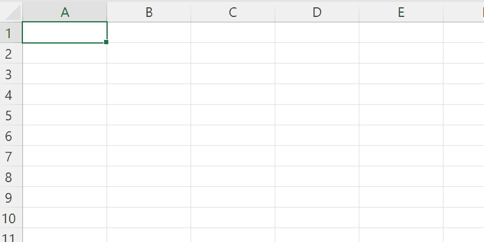
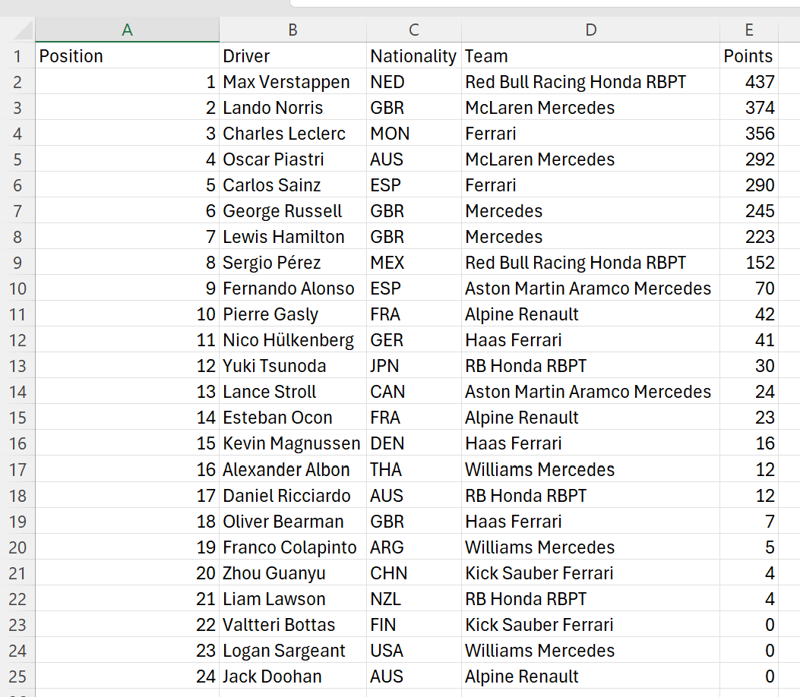
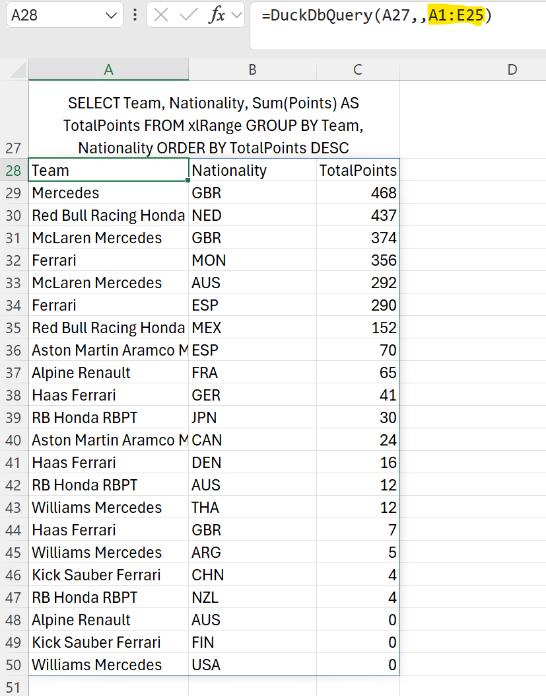
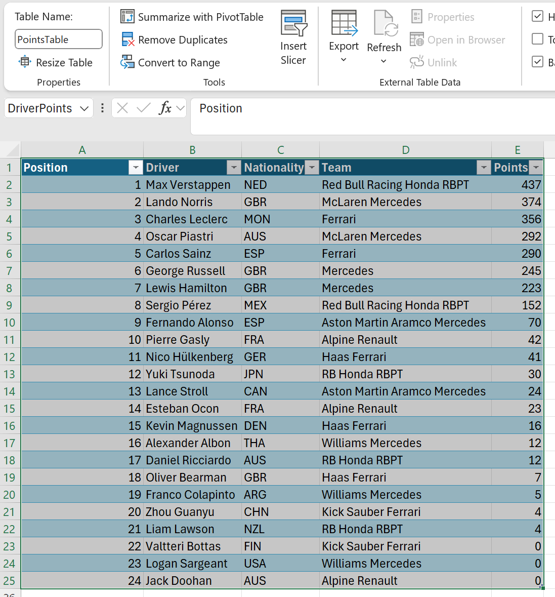
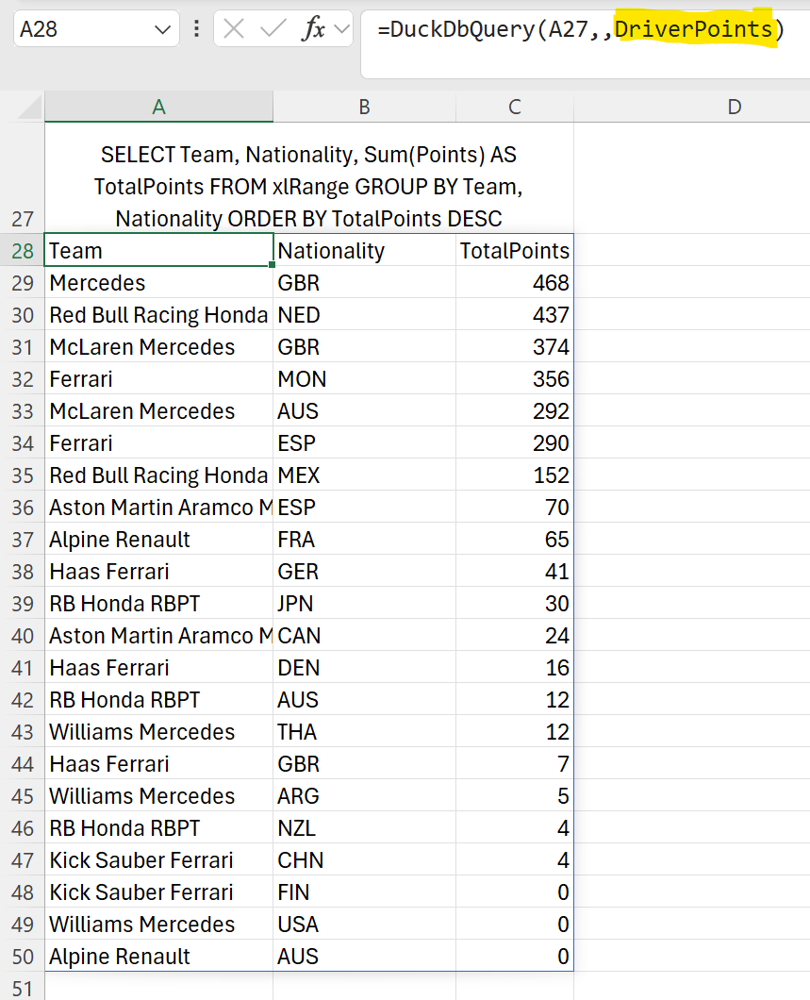
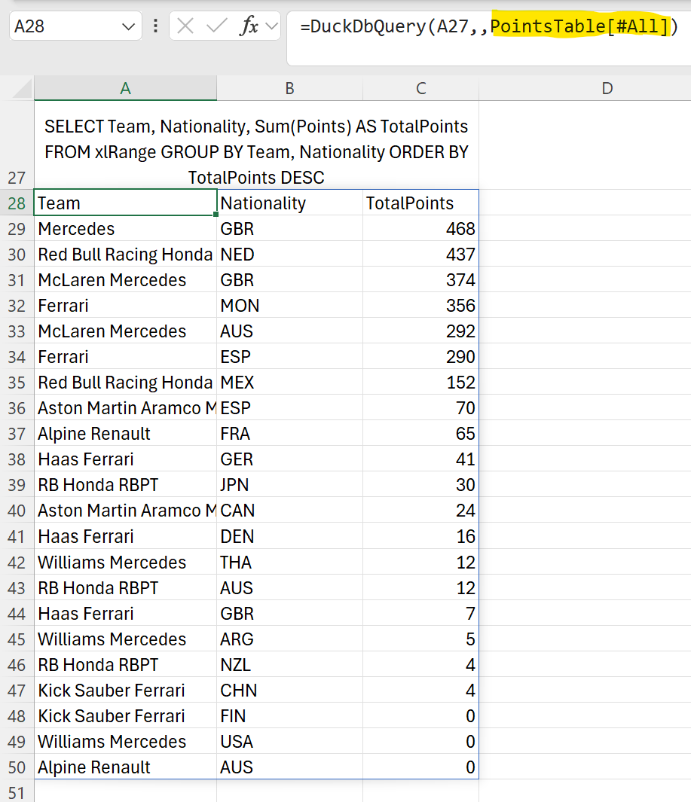

  

# xlDuckDb

Use DuckDB within Excel with the xlDuckDb addin.

DuckDB is an amazing tool with deep integration with Python and R, but sometimes you just need data in Excel. xlDuckDb allows DuckDB SQL to be run within Excel. Query results are returned as regular Excel cells.

# Installation

Download the xlduckdb.zip file from the latest release on the right.

Use the "Extract All" option on the right-click menu in Windows Explorer to extract contents of the zip file on your local PC.

Right-click on the xlDuckDb64.xll file and unblock it:

Double click on the xlDuckDb64.xll file to open the addin in Excel. The function _DuckDbQuery_ will be registered automatically.

## Requirements

xlDuckDb only runs on 64-bit Excel 365 released after Sept 2018. The dynamic array resizing functionality is required.

xlDuckDb v0.6.0 and above require the .Net 8.0 or later runtime. Usually a compatible version of .Net will already be installed, however the RunTime can also be downloaded from [.Net RunTime](https://dotnet.microsoft.com/en-us/download/dotnet/8.0)

# Usage

Any DuckDB SQL can be run and the results will be returned to Excel.

### A note on copying queries into Excel

When copying text such as SQL commands into Excel cells, add a **'** at the start so that Excel treats the input as a string.

## Querying Excel Ranges

Excel ranges can be queried as if the range was a regular DuckDb table. The keyword **xlRange** is used in queries, internally xlDuckDb substitutes the Excel range data.

> SELECT \* FROM **xlRange**

The range is passed as the third argument to the DuckDbQuery() function.

Here we copy in the 2024 F1 Drivers Points and query the range:

The data is in the range A1:E25

The range is passed as the third argument:

> =DuckDbQuery(A27,,A1:E25)

And the query is run against the Excel range:

### Named Ranges

Queries can be run against named ranges.

Here we pass the named range DriverPoints:

> =DuckDbQuery(A27,,DriverPoints)

### Table Data

Queries can be run against Excel table data.

Here we pass the table name PointsTable[All]:

> =DuckDbQuery(A27,,PointsTable[All])

> [!NOTE]
> Multiple Excel ranges can be passed to the DuckDbQuery() function. Any number of ranges can be passed as the 3rd, 4th, 5th..nth argument. These ranges can then be referenced in the SQL query as xlRange[1], xlRange[2]..xlRange[n].

## Querying JSON files

Reading data from JSON files can be difficult, particularly if the data is nested.

This JSON file contains details of Nobel prize laureates:

The data is presented as a list of dictionaries with the prizes field being a further list of dictionaries.

DuckDB allows the laureates names and birth countries to be extracted with a simple SQL SELECT. Notice how DuckDB allows the JSON file to be treated just like a regular database table:

> SELECT firstname, surname, bornCountry FROM 'laureate.json' LIMIT 5

Passing the SQL into the DuckDbQuery() function gives the following result:

We can now easily find the countries with the most Nobel prize winners:

> SELECT bornCountry AS Country, COUNT(\*) AS Number FROM 'laureate.json' GROUP BY bornCountry ORDER BY COUNT(\*) DESC LIMIT 5

DuckDB supports the use of JSONPath to extract values from nested JSON fields. This allows us to extract the category and motivation of the first prize awarded to each person:

> SELECT firstname, surname, prizes->>'\$[0].category' AS Category, prizes->>'\$[0].motivation'AS Motivation FROM 'laureate.json' LIMIT 5

Full details of DuckDB’s JSON capabilities are available in their documentation.

## Querying CSV files

Data is often stored in CSV files. Surprisingly, CSV is not a standardised data format and many variations exist. DuckDB is able to handle most CSV files automatically, detecting the column delimiters, data types, and so on.

This CSV file contains 10,000 sales records:

DuckDB allows the region, item type and total revenue for each sale to be extracted with a simple SQL SELECT. Notice how, just like the JSON example above, DuckDB allows the CSV file to be treated as a regular database table:

> SELECT Region, "Item Type", "Total Revenue" FROM '10000SalesRecords.csv' LIMIT 5

Passing the SQL into the DuckDbQuery() function gives the following result:

DuckDB has a user-friendly PIVOT statement that allows us to view the revenues in Asia and Europe broken down by item type:

> PIVOT '10000SalesRecords.csv' ON Region IN ("Europe", "Asia") USING sum("Total Revenue") GROUP BY "Item Type" ORDER BY "Item Type"

Data from multiple sources can be combined in a single SQL query. We can combine the JSON and CSV data to show the total sales in the countries with the most Nobel laureates:

> WITH CountrySales AS
> (SELECT
> CASE WHEN Country='United States of America' THEN 'USA' ELSE Country END AS Country,
> Sum("Total Revenue") AS Sales
> FROM '10000SalesRecords.csv'
> GROUP BY Country)
> SELECT
> cs.Country,
> SUM(cs.Sales) AS Sales,
> COUNT(\*) AS "Nobel Laureates"
> FROM CountrySales cs
> INNER JOIN 'laureate.json' l
> ON cs.Country = l.bornCountry
> GROUP BY cs.Country
> ORDER BY "Nobel Laureates" DESC LIMIT 5

This SQL uses a common table expression (CTE) to create a CountrySales result set that is joined to the JSON data. Note the use of a CASE expression ensure the country names match in both source data sets:

Full details of DuckDB’s CSV capabilities are available in their documentation.

## Querying Parquet files

Apache Parquet is an open source, column-oriented data file format designed for efficient data storage and retrieval. It provides efficient data compression and encoding schemes with enhanced performance to handle complex data in bulk.

DuckDB has extensive support for efficient querying of Parquet files. DuckDB allows very large Parquet datasets to be queried (even data sets that do not fit into memory), multiple files can be queried in parallel.

The Parquet file, titanic.parquet, contains details of Titanic survivors.

DuckDB allows the survival status, cabin class, sex and age of the passengers countries to be extracted with a simple SQL SELECT:

> SELECT Survived, Pclass, Sex, Age FROM 'titanic.parquet' LIMIT 5

Passing the SQL into the DuckDbQuery() function gives the following result:

We can now contrast the ages across cabin classes for survivors versus non-survivors:

> WITH Survivors AS
> (SELECT Pclass, Age, Sex
> FROM 'D:\github\xlslim-code-samples\duckdb\..\data\titanic.parquet'
> WHERE Survived=1)
> PIVOT Survivors ON Pclass USING AVG(Age) GROUP BY Sex

> WITH Survivors AS
> (SELECT Pclass, Age, Sex
> FROM 'D:\github\xlslim-code-samples\duckdb\..\data\titanic.parquet'
> WHERE Survived=0)
> PIVOT Survivors ON Pclass USING AVG(Age) GROUP BY Sex

Generally, younger passengers were more likely to survive, with the curious exception of first class female passengers.

Full details of DuckDB’s Parquet capabilities are available in their documentation.

## Querying from remote locations

DuckDB has functionality to directly query data located on https and in AWS S3.

As an example, the holdings.parquet file can be queried from https://duckdb.org:

> SELECT \* FROM 'https://duckdb.org/data/holdings.parquet';

Similarly we can attach to the DuckDB stations database in S3 and query the number of stations in each country:

Access to AWS S3 data usually requires credentials. See the DuckDB S3 API documentation for details about how to use secrets to provide credentials to S3.

Hopefully this gives a sense of the power of DuckDB! Please read the [DuckDB documentation](https://duckdb.org/docs/) for more information about DuckDB’s capabilities, including how to attach to SQLite, Postgress or indeed any ODBC databases.

## Thanks

xlDuckDb would not have been possible without the [ExcelDNA](https://github.com/excel-dna) and [DuckDB.NET](https://github.com/Giorgi/DuckDB.NET) projects.

The DuckDB query in Excel functionality was extracted from the commercial product [xlSlim](https://www.xlslim.com). If you need the same DuckDB functionality within a Digicert EV certificate signed addin then xlSlim is what you are looking for. xlSlim has a Windows .msi installer and is installable from [Chocolatey](https://community.chocolatey.org/packages/xlslim/). xlSlim's main purpose is to run Python functions within Excel as easily as possible.
